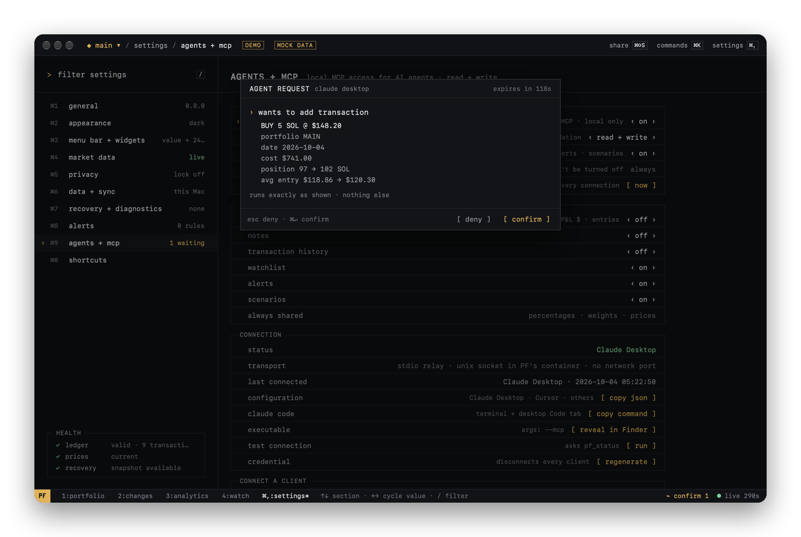

<p align="center">
  
</p>

<h1 align="center">PF Terminal</h1>

<p align="center">
  <b>A local-first crypto portfolio terminal for macOS and iPhone.</b><br>
  Native. Private. Keyboard-driven on the Mac.
</p>

<p align="center">
  
  
  
  
  <a href="LICENSE"></a>
</p>

<p align="center">
  No account. No tracking. No custody.<br>
  Your portfolio stays on your devices, or in your own iCloud if you choose.
</p>

<p align="center">
  <b>Available on macOS and iPhone.</b>
</p>

<p align="center">
  <a href="../../releases/latest"><b>Download for Mac</b></a> &nbsp;·&nbsp;
  <a href="https://apps.apple.com/us/app/pf-terminal/id6817097908"><b>Download on the App Store</b></a> &nbsp;·&nbsp;
  <a href="docs/GUIDE.md">User guide</a> &nbsp;·&nbsp;
  <a href="docs/AGENTS.md">AI agents (optional)</a> &nbsp;·&nbsp;
  <a href="docs/ROADMAP.md">Roadmap</a> &nbsp;·&nbsp;
  <a href="#support-pf">Support</a>
</p>

<p align="center">
  
</p>

PF Terminal is a native, local-first crypto portfolio tracker for Apple devices. It tracks crypto portfolios from a ledger of transactions and shows positions, cost basis, realized and unrealized P&L, performance and what moved your portfolio and why. On the Mac you can drive it entirely from the keyboard; on iPhone it adds Home Screen and Lock Screen widgets. PF Terminal does not execute trades and does not hold funds.

The macOS app and its shared portfolio core (PFCore) are open source in this repository. The iPhone app is available on the [App Store](https://apps.apple.com/us/app/pf-terminal/id6817097908); its source is not published here.

> **Current releases: macOS v0.8.2 · iPhone 1.0.0 on the [App Store](https://apps.apple.com/us/app/pf-terminal/id6817097908).** Since v0.8.0, "Agent Access": an optional way to connect an AI agent you choose to your local portfolio and manage it through MCP: off by default, read-only to start, every ledger change confirmed in PF, no server. See [What's new](CHANGELOG.md).

## Why PF?

Most portfolio trackers are cloud accounts. PF Terminal is a local instrument instead:

- **Local-first.** The ledger is a human-readable JSON file on your Mac or iPhone. There is no PF account or server. Optional iCloud sync between your devices uses your own private iCloud.
- **Real accounting.** Transactions are the source of truth. Holdings, average entry, cost basis and P&L are always derived from them.
- **Keyboard-first (Mac).** A command palette, the arrow keys, `↵` and `esc`, and a tmux-style status bar. The mouse is optional.
- **Honest data.** `LIVE` appears only when every quote is fresh. A missing price is shown as `$—`, never as `$0`.
- **No custody, no trading.** PF only reads public market data.

## Features

| | |
|---|---|
| **[Portfolios](docs/GUIDE.md#multiple-portfolios)** | Multiple independent portfolios and an **ALL PORTFOLIOS** aggregate. Buy, sell, transfer in and out. Average-cost accounting with fees. Realized and unrealized P&L. |
| **[Intelligence](docs/GUIDE.md#portfolio-intelligence)** | What Changed (market move vs money in / out), watchlist with watch → position, local alert rules with a backtest, scenarios of target prices, benchmark vs BTC / ETH. |
| **[Analytics](docs/GUIDE.md#analytics)** | Performance as value or P&L, total return and TWR, time-weighted drawdown, allocation, positions P&L, target simulator. |
| **[Market data](docs/HOW-IT-WORKS.md#market-data)** | Live Binance and Bybit feeds, CoinGecko fallback, DexScreener by verified contract. A bundled registry of the top 1,000 assets. Source status on every price. Stablecoin peg monitoring. USD, EUR, CHF. |
| **[Keyboard-first](docs/GUIDE.md#keyboard-first)** | `⌘K` palette with structured commands (`buy eth 0.5 @ 3500`), `g` + key navigation, themes and density. |
| **[macOS](docs/GUIDE.md#menu-bar)** | Menu bar companion, [desktop widgets](docs/GUIDE.md#desktop-widgets), [share cards](docs/GUIDE.md#share-cards) (PNG, MP4, GIF), notifications, Touch ID app lock. |
| **[iPhone](https://apps.apple.com/us/app/pf-terminal/id6817097908)** | Overview, movers, analytics, transactions and a command line, Home Screen and Lock Screen widgets with privacy modes, Face ID lock. Syncs with the Mac through the same optional iCloud sync. |
| **[iCloud sync](docs/ICLOUD-SYNC.md)** | Optional, off by default, through your private CloudKit database. Offline queue, conflict review, safe merge. |
| **[Recovery](docs/HOW-IT-WORKS.md#local-first-and-privacy)** | Local recovery snapshots with restore, Data Health, a diagnostic report without portfolio data. |
| **[AI agents (optional)](docs/AGENTS.md)** | Connect an MCP client you choose to your local portfolio: ask about it, and, if you allow it, record transactions and manage watchlist, alerts and scenarios, each change confirmed in PF. |

## Install

| | |
|---|---|
| **macOS** | [GitHub Releases](../../releases/latest): a signed and notarized DMG. Open source. |
| **iPhone** | [Download on the App Store](https://apps.apple.com/us/app/pf-terminal/id6817097908). Requires iOS 17 or later. |

### macOS

Requires **macOS 14 Sonoma** or later.

1. From the [latest release](../../releases/latest), download **`PF-Terminal.dmg`**.
2. Open it and drag **PF Terminal** into **Applications**.
3. Launch it. Releases are signed with a Developer ID and notarized by Apple.

To verify the download: `shasum -a 256 -c PF-Terminal.dmg.sha256`. The app doesn't update itself: **Check for Updates…** (app menu) opens the newest release; replace the app in Applications and your data is kept.

### iPhone

Install **PF Terminal** from the [App Store](https://apps.apple.com/us/app/pf-terminal/id6817097908). To see your Mac portfolios on iPhone, turn on iCloud sync on both devices with the same Apple Account (optional; see [iCloud sync](docs/ICLOUD-SYNC.md)).

**First run (Mac).** Create an empty portfolio, load the demo (marked DEMO, removable) or import a backup. Add a transaction with `⌘N`, or type `buy eth 0.5 @ 3500` in the palette (`⌘K`).

## Optional: connect an AI agent (MCP)

PF Terminal works fully on its own; no AI is needed or included. If you want, you can connect an AI agent of your choice — Claude Desktop, Claude Code, Cursor or any other [MCP](https://modelcontextprotocol.io) client — to **your local portfolio** and manage it in plain language:

> *"What hurt my portfolio most this week?"* · *"Compare my portfolio with BTC over 3 months"* ·
> *"Record a buy of 10 SOL at 120 in MAIN"* · *"Alert me if BTC drops below 80,000"*

<p align="center">
  
</p>

- **Off by default.** Turn it on in **Settings → agents + mcp**, then paste the configuration PF gives you into your client. Nothing listens while it is off.
- **You stay in control.** Read-only to start. With read + write, every change to the ledger and every deletion waits for your **confirm** in PF. Agents can preview a transaction first.
- **You choose what is exposed.** Exact values, notes and transaction history are hidden from agents unless you turn them on.
- **Local.** PF runs no server and opens no network port; the agent's client talks to the PF app on your Mac. If the agent itself is a cloud service, it processes what you expose to it.
- **Revocable at any time.** `⌘K` → *Disable MCP access*.

Setup for each client, the full tool list and troubleshooting: **[docs/AGENTS.md](docs/AGENTS.md)**.

## Privacy at a glance

- Your transactions, quantities and portfolio names stay on your devices (and in your private iCloud if you turn sync on).
- Network requests go only to public market-data APIs (asset identifiers, never quantities or values), Apple's iCloud if you turn on sync, and, on the Mac, GitHub when you check for updates.
- No account, no analytics, no crash reporting, no advertising.

Details: [How PF works](docs/HOW-IT-WORKS.md) · [Privacy policy](PRIVACY.md) · [Security](SECURITY.md).

## Documentation

| | |
|---|---|
| [User guide](docs/GUIDE.md) | Portfolios, keyboard, intelligence, analytics, menu bar, widgets, share cards |
| [AI agents (MCP)](docs/AGENTS.md) | Optional agent access: setup per client, permissions, confirmation, tools |
| [iCloud sync](docs/ICLOUD-SYNC.md) | How sync works, conflicts, protection against stale data |
| [How PF works](docs/HOW-IT-WORKS.md) | Privacy model, market data, accounting, architecture, tests |
| [Development](docs/DEVELOPMENT.md) | Build, signing, data formats, providers, releases |
| [Roadmap](docs/ROADMAP.md) · [Changelog](CHANGELOG.md) | Where PF is going, and what changed |

## Platforms

| Platform | Version | Status |
|---|---:|---|
| macOS | 0.8.2 | Available · [GitHub Releases](../../releases/latest) · Open source |
| iPhone | 1.0.0 | Available · [App Store](https://apps.apple.com/us/app/pf-terminal/id6817097908) |

The macOS app and the shared core are open source. The iPhone app is distributed through the App Store; its source isn't part of this repository.

## Build from source

Builds the macOS app. For developers and contributors: macOS 14+, Xcode 16+, no third-party dependencies.

```bash
git clone https://github.com/troshkinpavel/pf.git
cd pf
open PFTerminal.xcodeproj
```

Select the **PFTerminal** scheme and press `⌘R`. Signing, widgets, iCloud and release builds are described in [docs/DEVELOPMENT.md](docs/DEVELOPMENT.md).

## Contributing

Issues and pull requests are welcome. [CONTRIBUTING.md](CONTRIBUTING.md) explains how to build, test and submit changes.

## Support PF

PF Terminal for macOS is free and open source. If PF is useful to you and you want to support its development, you can send a crypto tip to this address:


```text
0x858DAB719f51A23B13c6D9F456c485b31Ca55a07
```

This is an **EVM address**. The project doesn't list specific networks for tips, so if you're unsure, use Ethereum mainnet. Before you send, check that your wallet is on the network you intend. Assets sent on the wrong network may not be recoverable.

To swap into a token first, use the [Uniswap app](https://app.uniswap.org) and then send to the address above. Uniswap is a third-party service. It isn't affiliated with PF Terminal and doesn't endorse it.

> Tips are optional and do not unlock features.

<br clear="right">

## License

[MIT](LICENSE).

## Disclaimer

PF Terminal is portfolio tracking and analytics software. It is not financial advice, and it does not execute trades or hold assets. AI agents you connect are third-party software; check what they propose before you confirm it. Market data comes from third-party providers and may be delayed or wrong. Verify it before you make decisions.
