<p align="center">
  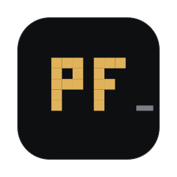
</p>

<h1 align="center">PF Terminal</h1>

<p align="center">
  <b>A local-first crypto portfolio terminal for macOS.</b><br>
  Native. Private. Keyboard-driven.
</p>

<p align="center">
  
  
  
  <a href="LICENSE"></a>
</p>

<p align="center">
  No account. No tracking. No custody.<br>
  Your portfolio stays on your Mac, or in your own iCloud if you choose.
</p>

<p align="center">
  <a href="../../releases/latest"><b>Download latest</b></a> &nbsp;·&nbsp;
  <a href="#icloud-sync">iCloud sync</a> &nbsp;·&nbsp;
  <a href="#build-from-source">Build from source</a> &nbsp;·&nbsp;
  <a href="#roadmap">Roadmap</a> &nbsp;·&nbsp;
  <a href="#support-pf">Support</a>
</p>

<p align="center">
  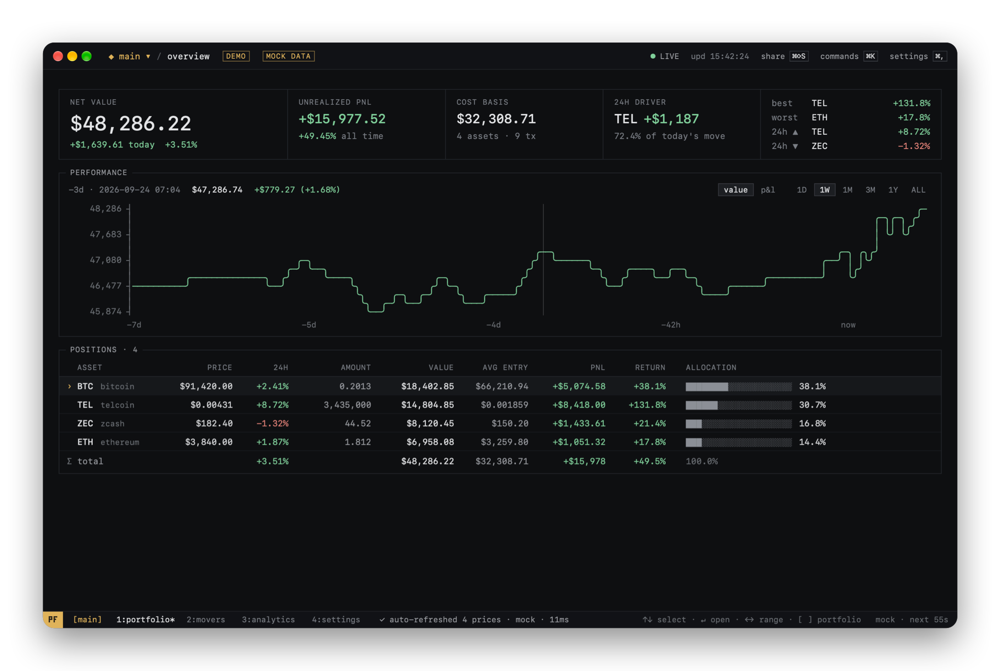
</p>

PF Terminal tracks crypto portfolios from a ledger of transactions. It shows positions, cost basis, realized and unrealized P&L, performance and 24h movement. The interface is a native macOS window that you can drive entirely from the keyboard. PF Terminal does not execute trades and does not hold funds.

> **Status:** the current release is v0.5.0: live exchange prices and a built-in asset registry. v0.4.0 was the first public release. PF Terminal is distributed as a `.dmg` through GitHub Releases. There is no Homebrew package.
>
> **New in v0.4: [iCloud sync](#icloud-sync).** Optional sync between your own devices through your private iCloud. Off by default.

## Platforms

| Platform | Version | Status |
|---|---:|---|
| macOS | 0.5.0 | Available · Open source |
| iPhone | 0.1.0 | In development |

The iPhone companion app is currently in development.

---

## Why PF?

Most portfolio trackers are cloud accounts. PF Terminal is a desktop instrument instead:

- **Local-first.** The ledger is a human-readable JSON file on your Mac. There is no PF account or server. Optional iCloud sync uses your own private iCloud, not a PF service.
- **Real accounting.** Transactions are the source of truth. Holdings, average entry, cost basis and P&L are always derived from them.
- **Keyboard-first.** A command palette, the arrow keys, `↵` and `esc`, and a tmux-style status bar. The mouse is optional.
- **Honest data.** `LIVE` appears only when every quote is fresh. A missing price is shown as `$—`, never as `$0`.
- **No custody, no trading.** PF only reads public market data.

## Features

| | |
|---|---|
| **Portfolios** | Multiple independent portfolios and an **ALL PORTFOLIOS** aggregate. Buy, sell, transfer in and transfer out. Average-cost accounting with fees. Realized and unrealized P&L. Editable transactions. |
| **Market** | Live prices from Binance and Bybit, CoinGecko as a batched fallback, DexScreener by verified contract. A built-in registry of the top 1,000 assets for instant, offline search. Each price shows where it comes from (LIVE, CACHED, FALLBACK, STALE). A preferred source, globally or per asset. Stablecoins valued at their peg, with depeg detection. USD, EUR and CHF. |
| **Analysis** | Performance charts (value or P&L). Flow-adjusted 24h contribution. Movers by % or $ impact. Allocation, contribution, cost basis → value. Time-weighted drawdown. Target price scenarios. |
| **Terminal UX** | `⌘K` palette with structured commands. Portfolio switching with `⌘P` and `[ ]`. ASCII-style charts. Adjustable density. |
| **macOS** | Menu bar companion. Desktop widgets (small, medium, large). Share cards: copy, save PNG, share sheet. Opt-in notifications. Touch ID app lock. |
| **Sync** | Optional iCloud sync through your private CloudKit database. Off by default. It includes an offline queue, conflict review with restore, and a safe merge when you turn it on. |
| **Privacy** | No telemetry. Only public market-data requests leave your Mac. Share cards and widgets have privacy modes. Optional API key stored in the Keychain. |

## Install

### Download

Requires **macOS 14 Sonoma** or later.

**[Download the latest release →](../../releases/latest)**

1. From the [latest release](../../releases/latest), download **`PF-Terminal.dmg`**.
2. Open the `.dmg` and drag **PF Terminal** into **Applications**.
3. Launch PF Terminal from Applications. The first time, macOS asks you to confirm opening an app downloaded from the internet. Click **Open**.

Releases are signed with a Developer ID and notarized by Apple, so Gatekeeper accepts them with no extra steps.

You don't need an account, Xcode or any other dependencies. Releases are versioned. Each release has release notes and a `PF-Terminal.dmg.sha256` checksum. To verify the download:

```bash
shasum -a 256 -c PF-Terminal.dmg.sha256
```

The app does not update itself.
- **Checking for updates.** **Check for Updates…** (in the app menu, or under Settings → GENERAL) compares your version with the latest GitHub release. If a newer one exists, it opens that release page.
- **Updating.** Download the new release and replace the app in Applications. Your portfolio data is kept, because it lives outside the app bundle.


## First run

1. Create an empty portfolio, load the demo portfolio (clearly marked DEMO and removable), or import a backup.
2. Add a transaction with `⌘N`, or type `buy eth 0.5 @ 3500` in the palette (`⌘K`).
3. PF Terminal fetches market prices and calculates the portfolio from your transactions.

## Multiple portfolios

<p align="center">
  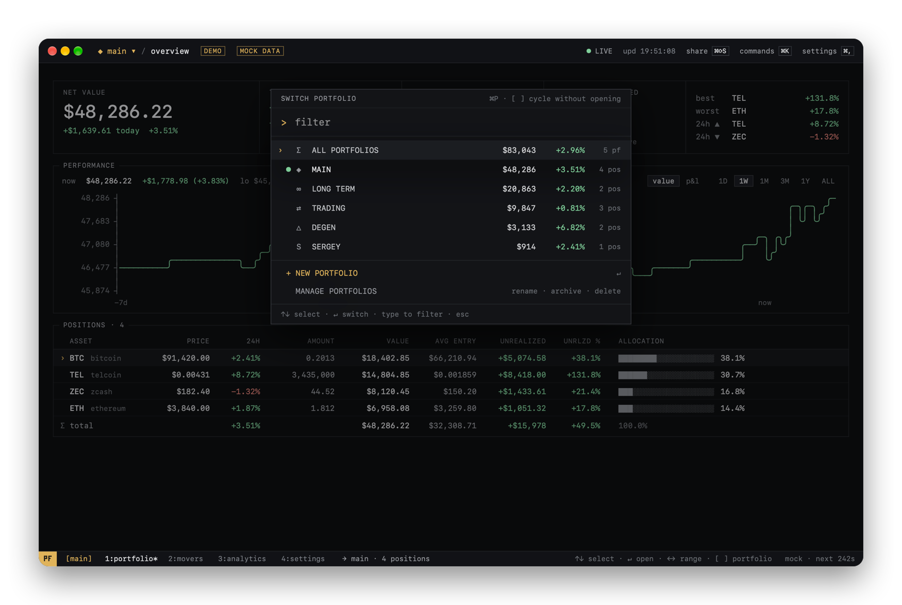
</p>

Keep separate books, for example `MAIN`, `LONG TERM`, `TRADING` and `DEGEN`. Each one has its own transactions, positions, P&L, history, movers and analytics.

- **Switching.** `⌘P` opens the switcher. `[` and `]` step through the portfolios without opening it. Switching recomputes from cached prices, so it is instant.
- **ALL PORTFOLIOS** is computed, never stored. The app calculates each portfolio with its own average cost, then adds the results. The same coin held in two portfolios is not double-counted, and sells are not re-averaged across portfolios.
- **Management.** Rename, archive/restore and delete (with confirmation) on the `/ portfolios` screen. Archived portfolios keep their data but disappear from the switcher, ALL, the menu bar and the widgets.

<p align="center">
  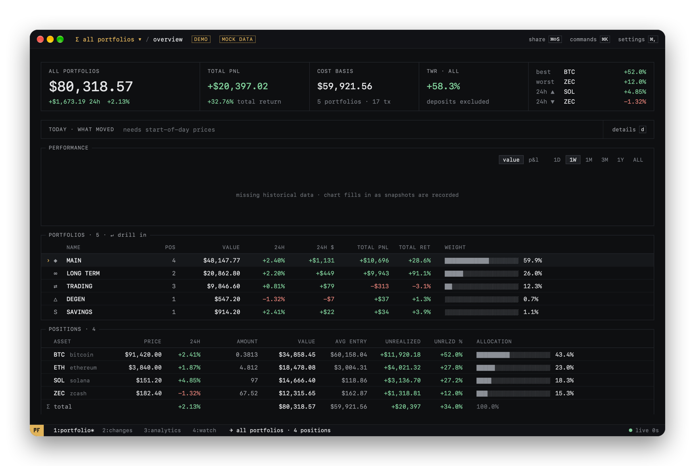
</p>

## Keyboard-first

<p align="center">
  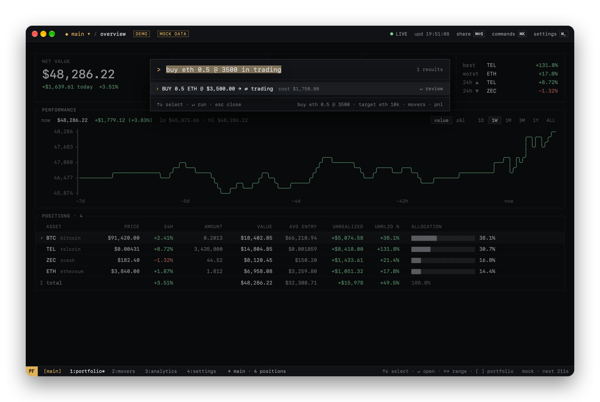
</p>

The palette understands commands as well as fuzzy search. Commands that change data always open a preview first. Nothing is written until you confirm.

```text
buy eth 0.5 @ 3500               sell btc 0.1 at 90000         in eth 2   ·   out btc 0.05
buy eth 0.5 @ 3500 in trading    (choose the destination portfolio)
target eth 10k                   target btc 150k               target eth 25x
portfolio long term              pf all                        new portfolio swing
share 24h public                 share value portrait phosphor
movers   pnl   allocation   settings   refresh   export   import
```

| Action | Keys | | Action | Keys |
|---|---|---|---|---|
| Command palette | `⌘K` | | Switch portfolio | `⌘P` |
| New transaction | `⌘N` | | Previous / next portfolio | `[` `]` |
| Refresh prices | `⌘R` | | Quick share | `⌘⇧S` |
| Portfolio · Movers · Analytics · Settings | `⌘1`–`⌘4` | | Copy / save card | `⌘C` / `⌘S` |
| Select · open · back | `↑↓` `↵` `esc` | | Chart range | `←` `→` |
| Search assets | `/` | | Target (asset) · edit · delete tx | `t` · `e` · `⌫` |

Shortcuts are bound to physical key positions, so they also work with non-Latin keyboard layouts. Keys without modifiers are ignored while a text field has focus.

## Analytics

<p align="center">
  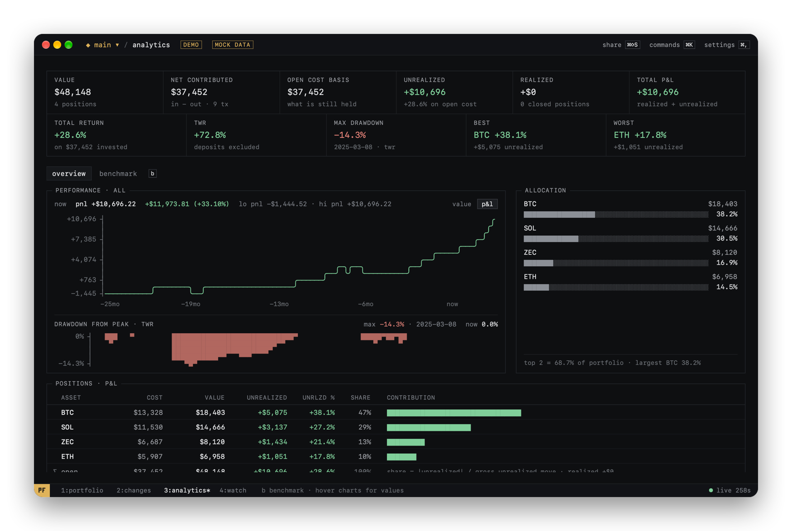
</p>

- **Performance charts** switch between **value** and **P&L** (value minus net money invested). P&L shows the drawdown periods that deposits would otherwise hide.
- **Performance headers** show the P&L change and a money-weighted return.
- **Drawdown** uses a time-weighted index.
- **Portfolio history** is rebuilt from what you held at each point in time. It never multiplies today's holdings by past prices.
- **The target simulator** turns a price target into position value, profit, multiple and implied market cap. It is a calculator, not a prediction.

<p align="center">
  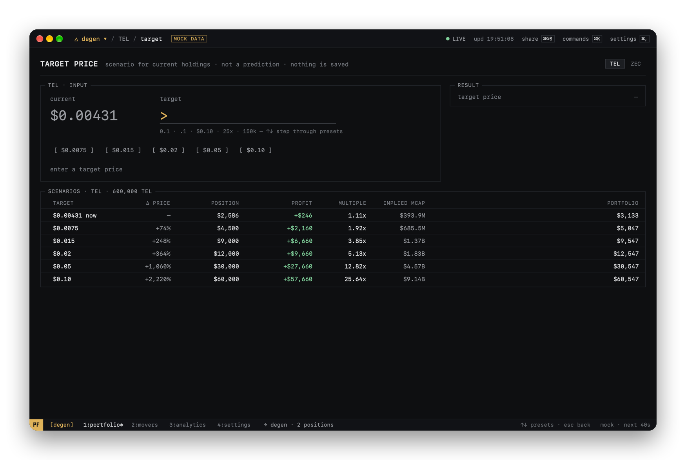
</p>

## Menu bar

<p align="center">
  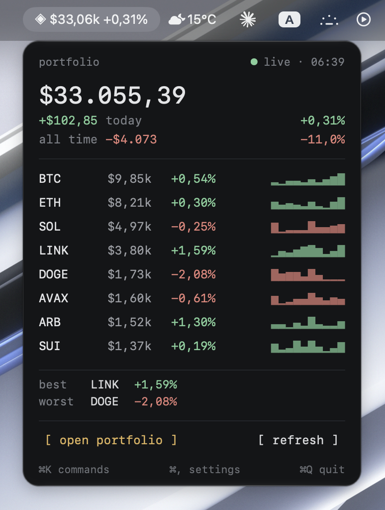
</p>

PF Terminal stays in the menu bar when the main window is closed, and leaves the Dock until you open the window again. To keep the Dock icon, turn on Settings → GENERAL → keep in Dock when closed.

- **Menu bar item.** Four display formats. It follows the active portfolio or is pinned to ALL.
- **Popover.** Today's change, all-time P&L, the top positions with 24h sparklines, best and worst, refresh, and a button to open the app.

## Desktop widgets

<p align="center">
  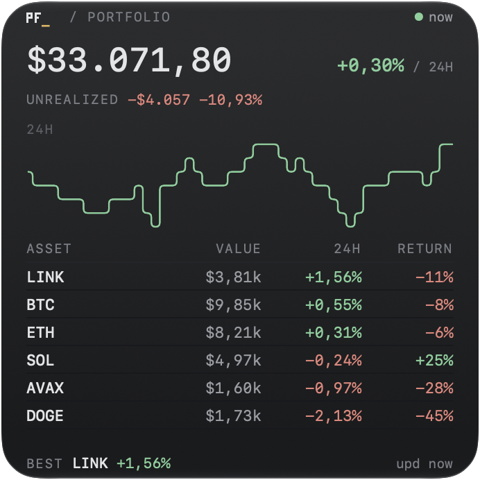
  &nbsp;
  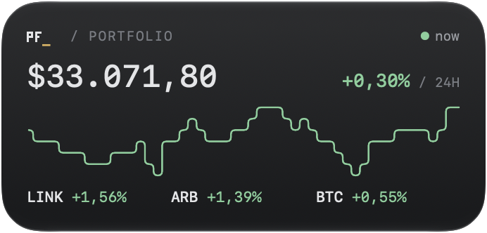
  &nbsp;
  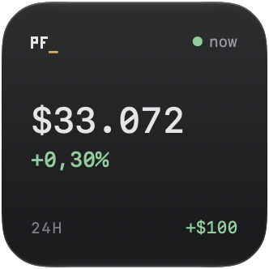
</p>

Widgets come in small, medium and large sizes. You configure each widget separately:

- **Portfolio.** Any portfolio, ALL, or follow the app.
- **Display.** Value + 24h, 24h only, or value only.
- **Privacy.** Value shown or hidden.
- **Movers.** Top gainers or biggest portfolio impact.

Widgets render a snapshot that the app has already prepared. They are not realtime terminals. The age of the data is always shown: `● now`, `upd 7m` or `STALE · 3h`. With **Settings → Widget privacy** off, the app removes dollar amounts from the widget data before writing it. Clicking a widget opens PF Terminal. In the medium and large widgets, clicking a row opens that asset.

## Share cards

<p align="center">
  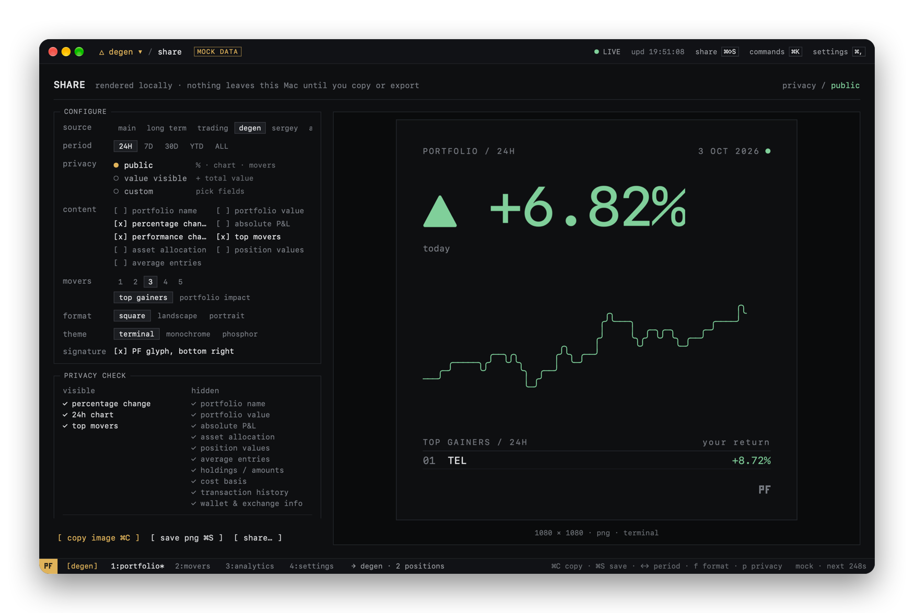
</p>

PF Terminal draws dedicated share images; it does not screenshot the window. The formats are square 1080×1080, landscape 1200×675 and portrait 1080×1350. There are three themes. You can copy the image, save it as PNG, or use the macOS share sheet.

<p align="center">
  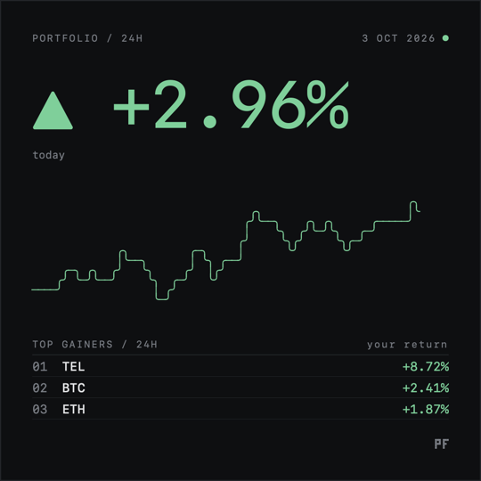
  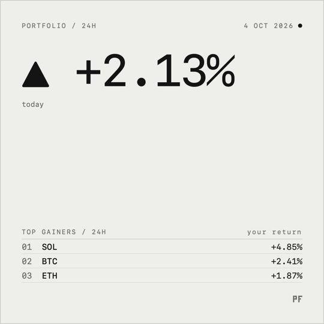
  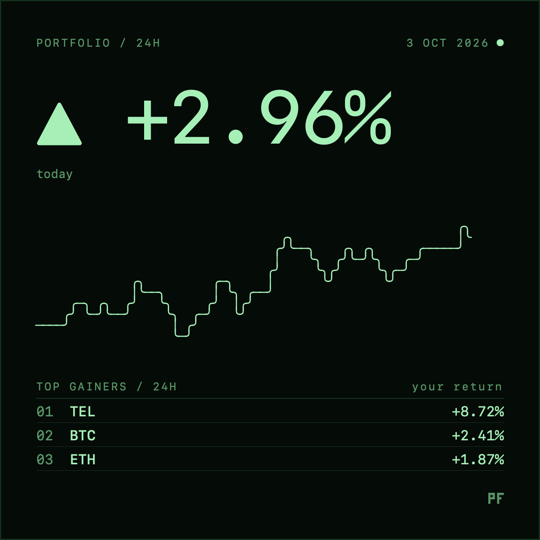
</p>

- **Privacy.** **PUBLIC** is the default. It shows percentage performance, the chart and the movers, but no value, holdings or amounts. **VALUE VISIBLE** adds the total value. In **CUSTOM**, sensitive fields (P&L, position values, average entries, portfolio name) must be switched on explicitly.
- **What the card contains.** Hidden fields never enter the card's data model, so they cannot appear in the image. Tests check this.

## iCloud sync

iCloud sync keeps your portfolios in step across your own devices. It is **off by default**. Nothing is uploaded until you turn it on in **Settings → DATA & SYNC** and confirm.

- **Your iCloud, not ours.** Data goes to the **private** CloudKit database of the Apple Account signed in on your Mac. PF has no server and no account, and it cannot see your data. Transaction data is stored in CloudKit's encrypted fields.
- **What syncs.** Portfolios, transactions and asset identities. Records are matched by stable IDs, so renaming a portfolio or importing the same backup twice never creates duplicates.
- **What never syncs.** Market prices and caches, charts and P&L (every device recalculates them), widget data, settings, and API keys or anything else in the Keychain.
- **Turning it on.** PF first compares this Mac with iCloud, then asks what to do:
  - iCloud is empty → **upload**.
  - This Mac is empty → **use iCloud**.
  - Both have data → **merge** or **use iCloud**. Before replacing anything, PF saves a backup of this Mac's ledger.
- **Offline.** Changes are saved locally first and queued. They upload when iCloud is reachable again, even after a restart.
- **Conflicts.** Sometimes the same transaction changes on two devices before they sync. PF keeps the newer edit, and an edit always wins over a delete. A copy that was never synced (for example, a restored backup) never overrides what is in iCloud. The other version stays in **Settings → DATA & SYNC → conflicts**, where you can restore it.
- **Turning it off.** Your portfolios stay on your Mac, and the iCloud copy is not deleted. If you turn sync on again later, PF compares both sides again first.
- **Availability.** iCloud sync ships in v0.4.0 and is off by default. It needs macOS 14 or later and an Apple Account signed in to iCloud. If you build from source, sync needs a build signed with the iCloud capability (see [docs/DEVELOPMENT.md](docs/DEVELOPMENT.md#icloud-sync-optional)). The iPhone companion app (in development) uses the same sync and the same private database.
- **Validation.**
  - The sync engine has automated tests against a simulated CloudKit store.
  - The full flow was also checked between two independent PF stores, in both CloudKit's development and production environments. It covered upload and download, edits, renames, archiving, deletes, the offline queue across a restart, conflicts and restore, and turning sync off and on again.
  - The notarized v0.4.0 release app was checked against production CloudKit.

## Local-first and privacy

```text
your transactions ─▶ PF engine (on your Mac) ─▶ ~/Library/Containers/…/pf/portfolio.json
                                                  market cache (SwiftData, same container)
                         └─ optional iCloud sync ─▶ your private CloudKit database (portfolios, transactions)

market-data APIs ◀── coin identifiers only (e.g. "bitcoin", "BTCUSDT", chain + contract)
```

- **Portfolio data** stays on your Mac: transactions, quantities, cost basis and portfolio names. If you turn on [iCloud sync](#icloud-sync), it is also copied to your private iCloud. PF has no account, no backend, no analytics and no crash reporting.
- **Network requests** go only to Binance, Bybit, CoinGecko and DexScreener (public market data, no account), plus Apple's iCloud if you turn on sync. They carry asset identifiers, plus your search text when you look up a new asset. They use an ephemeral HTTP session, with no cookies. No quantities or values are ever sent.
- **API key.** You can add an optional CoinGecko key. It is stored in the Keychain and sent only to `api.coingecko.com`.
- **Sandboxing.** The app is sandboxed, with outgoing network access and access to files you choose. Widgets read a small snapshot from a shared App Group container. That snapshot contains no transactions.
- **Backups.** Export writes a readable `.json` backup. Import validates the whole file and asks for confirmation before it replaces anything.

## Market data

- **Asset registry.** The app includes a registry of the top 1,000 assets, with their verified exchange pairs and contracts. Searching for an asset is instant and works offline. Tickers that belong to more than one asset are never picked for you.
- **Where prices come from.** With **Auto** (the default), each asset uses live exchange feeds first: Binance, then Bybit. CoinGecko is the batched fallback, and DexScreener is used only for an asset's verified contract. A source is used only when the asset is verified to trade there; nothing is matched by ticker alone.
- **Price status.** Asset Detail shows the source and state of each price: `LIVE · BINANCE`, `CACHED · 2m`, `DELAYED · 6m`, `FALLBACK · COINGECKO`, `STALE · 18m` or `NO PRICE`. If your preferred source fails, the fallback is labeled as such.
- **Preferred source.** Choose Auto, Binance, Bybit or CoinGecko in Settings → MARKET DATA. For a single asset, use **Asset Detail → price source**, which only offers the sources that asset actually has.
- **Refresh.** Live feeds update prices continuously. Other prices refresh every 60 s by default (15 s to 5 min), less often in the background, never during sleep. Cached prices appear immediately at launch. CoinGecko is asked much less often than before, so rate limits rarely leave a gap.
- **Stablecoins.** USDT, USDC and other USD stablecoins are valued at exactly $1.00 while within ±0.5% of the peg. Their peg is checked every few minutes. Outside that band they're marked **DEPEG** and valued at the real market price.

## Accounting model

Transactions are the source of truth. PF never stores a balance; it derives everything from the ledger:

- **Average cost.** Fees are added to the cost basis on buys and subtracted from the proceeds on sells. A sell realizes P&L against the average cost. A full exit clears the cost basis exactly.
- **Exact decimals.** Ledger maths uses `Decimal`.
- **24h change is flow-adjusted.** A buy made today is not counted as a gain. The **24H DRIVER** is the position that moved the portfolio's value the most, which is not necessarily the one with the largest percentage move.
- **Validation.** A sell can't exceed what the portfolio held at that date.

## Architecture

```text
Package.swift      the PFCore Swift package (products PFCore, PFCoreUI, PFCoreTestSupport)
PFCore/            platform-neutral core (no AppKit/UIKit/SwiftUI), shared by PF Terminal clients
├── Domain/        portfolio engine, history, movers, scenarios, transaction planner, command parser, share privacy
├── Market/        provider router · CoinGecko · Binance (REST + WebSocket) · DexScreener · mock
├── Persistence/   JSON ledger (schema-versioned, migrated), settings, SwiftData market cache
├── Platform/      Keychain, notifications, app lock (LocalAuthentication), reachability
├── Sync/          sync engine, record model, CloudKit store (private database), host helpers
├── Formatting/    number and date formatting
└── Widgets/       widget snapshot model and App Group store
PFCoreUI/          shared SwiftUI: design tokens, widget layouts, share card
PFCoreTestSupport/ in-memory CloudKit stand-in for tests      PFCoreTests/ package tests (wire format)
PFTerminal/        macOS app (App, Persistence, System, UI)
PFWidgets/         macOS WidgetKit extension (App Intents configuration)
PFTerminalTests/   unit tests (Swift Testing)                 PFTerminalUITests/ UI tests (XCUITest)
```

The app is built with Swift, SwiftUI and AppKit. It also uses SwiftData (the market cache), WidgetKit and App Intents, and `URLSession` (REST and WebSocket). Charts are custom SwiftUI drawing; Swift Charts is not used.

**Tests.**
- Unit tests cover:
  - accounting and history;
  - multiple portfolios and the ALL aggregate;
  - migrations, including the move from the earlier app identity;
  - backup validation, command parsing and provider fallback;
  - share-card and widget privacy;
  - sync, against a simulated CloudKit store with two devices, including a second client exchanging portfolios, transactions and deletes with the real Mac app state;
  - the PFCore package tests pin the sync payloads and CloudKit record fields that every PF client shares.
- UI tests cover onboarding, a palette trade with confirmation, and quick share.

The build, signing, data formats and how to add a market-data provider are documented in **[docs/DEVELOPMENT.md](docs/DEVELOPMENT.md)**.

## Build from source

This section is for developers and contributors. You need macOS 14 Sonoma or later and Xcode 16 or later. There are no third-party dependencies.

```bash
git clone https://github.com/troshkinpavel/pf.git
cd pf
open PFTerminal.xcodeproj
```

Select the **PFTerminal** scheme and press `⌘R`. Or build from the command line:

```bash
xcodebuild -project PFTerminal.xcodeproj -scheme PFTerminal -configuration Release -derivedDataPath build build
open "build/Build/Products/Release/PF Terminal.app"
```

A fresh clone builds ad hoc and runs immediately. The desktop widgets are the exception: they share data through an App Group, which needs a signing team and a provisioning profile. To enable them, add `Config/Signing.local.xcconfig`. The file is gitignored.

```text
DEVELOPMENT_TEAM = YOURTEAMID
CODE_SIGN_IDENTITY = Apple Development
CODE_SIGN_STYLE = Automatic
```

`scripts/make-dmg.sh` produces the release `PF-Terminal.dmg` and its checksum. It signs with Developer ID. When `NOTARY_PROFILE` is set, it also notarizes and staples the app and the DMG, then checks them with Gatekeeper.

## Roadmap

> Local-first is a feature, not a temporary limitation.

Roadmap milestones are product milestones, not app version numbers. The iPhone app has its own version line.

| Version | Scope | Status |
|---|---|---|
| v0.1 · Core terminal | Overview, movers, analytics, asset detail, transactions, command palette, share cards, menu bar, settings | **done** · internal milestone |
| v0.2 · Multiple portfolios | Independent portfolios, ALL aggregate, switcher, management, v1 → v2 migration | **done** · internal milestone |
| v0.3 · Widgets & alerts | Desktop widgets, portfolio 24h-move notification | **done** · internal milestone |
| v0.4 · iCloud sync | Optional sync between your own devices through your private iCloud (CloudKit) database, off by default | **done** |
| v0.5 · Market data | Canonical Asset Registry (bundled top-1000) · offline local asset search · Binance + Bybit live pricing · selectable preferred source · LIVE / CACHED / FALLBACK source status · far fewer CoinGecko requests · canonical-contract DexScreener fallback · stablecoin / cash-like support with peg monitoring · stale-while-revalidate caching | **done** · current |
| v0.6 · Reliability & data integrity | Hardened iCloud sync, local snapshots and recovery, sync status and diagnostics without sensitive data, market-source health ([plan](docs/ROADMAP-0.6.md)) | planned |
| v0.7 · Advanced analytics & scenario lab | Benchmarks (vs BTC / ETH), period return tables, realized P&L reports, multi-asset and portfolio-wide scenarios (today: single-asset target simulator) | planned |
| v0.8 · Automation & alerts | Per-asset price alerts, Shortcuts / App Intents actions, scheduled exports and share cards | planned |
| v0.9 · Wallets & exchanges | Read-only on-chain addresses (watch-only wallets), read-only exchange APIs, CSV import | planned |
| v1.0 · Stable PF Terminal for macOS | Stable, signed and notarized macOS release | planned |
| v2.0 · PF Terminal for iPhone | Native iOS app sharing the portfolio and accounting core | **in development** |
| v2.1 · iOS widgets | Home and lock screen widgets | **in development** |
| v2.2 · Apple ecosystem | Deeper system integration across Apple platforms | planned |
| v3.0 · PF Cloud | Optional hosted features | exploratory |

## Contributing

Issues and pull requests are welcome. Please report bugs and feature requests through GitHub Issues. [CONTRIBUTING.md](CONTRIBUTING.md) explains how to build, test and submit changes.

## Support PF

PF Terminal is free and open source. If it's useful to you and you want to support its development, you can send a crypto tip to this address:


```text
0x858DAB719f51A23B13c6D9F456c485b31Ca55a07
```

This is an **EVM address**. The project doesn't list specific networks for tips, so if you're unsure, use Ethereum mainnet. Before you send, check that your wallet is on the network you intend. Assets sent on the wrong network may not be recoverable.

To swap into a token first, use the [Uniswap app](https://app.uniswap.org) and then send to the address above. Uniswap is a third-party service. It isn't affiliated with PF Terminal and doesn't endorse it.

> Tips are optional and do not unlock features.

<br clear="right">

## License

[MIT](LICENSE).

## Disclaimer

PF Terminal is portfolio tracking and analytics software. It is not financial advice, and it does not execute trades or hold assets. Market data comes from third-party providers and may be delayed or wrong. Verify it before you make decisions.
