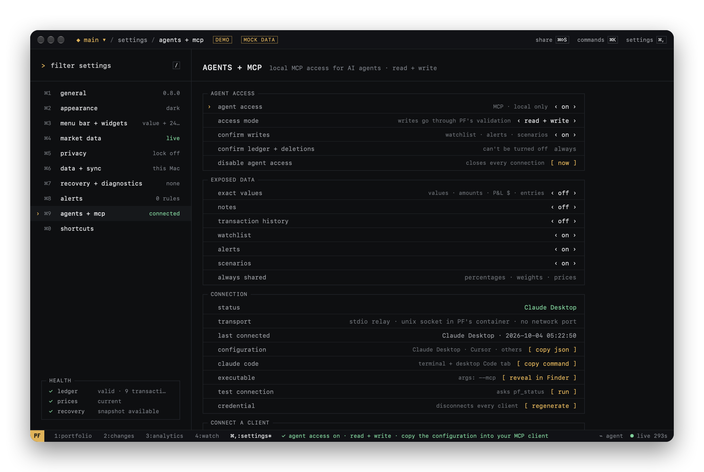

# Agent Access (MCP)

*Your portfolio. Your data. Your agent.*

**Optional.** PF Terminal works fully without it, and it is off until you turn it on.

Agent access lets you connect an AI agent you choose — Claude Desktop, Claude Code, Cursor, another
MCP client, or a local agent — to your **local portfolio** and manage it in plain language: ask how
it is doing and what moved it, and, if you allow it, record transactions and manage your watchlist,
alerts and scenarios. Every change goes through PF's own validation, and every change to the ledger
waits for your confirmation in PF.

PF does not contain an AI model, has no server and needs no account. It exposes a local
[Model Context Protocol](https://modelcontextprotocol.io) interface on your Mac, only while you
have it switched on. Back to the [README](../README.md).

<p align="center">
  
</p>

## What happens to your data

- **PF itself sends nothing anywhere.** The agent connects to PF on your Mac; PF never uploads
  your portfolio to a PF service (there isn't one).
- **Your agent may.** If your MCP client is cloud-based (most chat apps are), whatever PF returns to
  it is processed by that client's provider under its own terms. Expose only what you are comfortable
  sharing with that provider. Local agents keep everything on your Mac.
- **You decide what is exposed.** Exact values, notes and transaction history are off by default.
  PF removes hidden data before answering; it never relies on the agent to "not show" something.

## Turn it on

1. **Settings → agents + mcp** (`⌘,` then `⌘9`), or `⌘K` → *Enable Agent Access*.
2. Set **agent access** to *on*. The access mode starts as **read only**.
3. Choose what to expose under **EXPOSED DATA**.
4. Connect your client (below). Each one needs PF's path, `--mcp`, and your credential; PF fills
   them in for you.
5. **test connection → run** in PF checks the whole path from PF's side.

PF must be running (the menu bar item is enough). If it isn't, or access is off, the client gets a
clear "PF Terminal isn't running, or Agent Access is off" error.

## Connect a client

### Claude Desktop (chat)

1. In PF: **configuration → copy json**.
2. In Claude: **Settings → Developer → Edit Config**. This opens
   `~/Library/Application Support/Claude/claude_desktop_config.json`.
3. If the file has no `"mcpServers"` yet, add the copied block as a new top-level key. If it has
   other keys (`"preferences"`, …), keep them and add a comma: the result looks like this.
   If `"mcpServers"` already exists, add only the `"pf-terminal": { … }` entry inside it.

```json
{
  "preferences": { … },
  "mcpServers": {
    "pf-terminal": {
      "command": "/Applications/PF Terminal.app/Contents/MacOS/PF Terminal",
      "args": ["--mcp"],
      "env": { "PF_MCP_TOKEN": "pfm_…" }
    }
  }
}
```

4. Quit Claude with **⌘Q** (closing the window isn't enough) and reopen it.
5. **Settings → Developer** shows *pf-terminal* as running; in a chat, the tools appear in the
   tools menu under the message box. Ask: *"How is my portfolio doing today?"*

### Claude Code (terminal, and the Code tab of the desktop app)

1. In PF: **claude code → copy command**. It looks like:

```bash
claude mcp add pf-terminal --scope user -e PF_MCP_TOKEN=pfm_… -- "/Applications/PF Terminal.app/Contents/MacOS/PF Terminal" --mcp
```

2. Run it in Terminal once. `--scope user` makes it available in every project.
3. Start a new session. In the terminal, `/mcp` lists *pf-terminal* as connected.
4. To remove it: `claude mcp remove pf-terminal --scope user`.

### Cursor

Paste the copied JSON into `~/.cursor/mcp.json` (all projects) or `.cursor/mcp.json` in a project
(merge into `"mcpServers"` as above), or add it in **Cursor Settings → MCP**. Reload Cursor.

### Other MCP clients

Any client that starts local (stdio) MCP servers works. It needs:
- command: the PF Terminal executable (`/Applications/PF Terminal.app/Contents/MacOS/PF Terminal`)
- arguments: `--mcp`
- environment: `PF_MCP_TOKEN` = your credential (from the copied configuration)

### Good to know

- The credential is like a password for agent access on this Mac. Don't share the configuration.
  **credential → regenerate** in PF invalidates every copy; paste the new one into each client.
- Clients ask your permission before calling a tool; that is separate from PF's own confirmation
  of changes.
- A moved or renamed PF app changes the path: copy the configuration again.

## Access modes

| Mode | The agent can |
|---|---|
| off (default) | nothing: no socket exists, every request fails |
| read only (default when on) | read what you exposed |
| read + write | also propose changes: transactions, watchlist, alerts, scenarios |

## Confirmation

Changes don't happen silently.

- **Always confirmed** (cannot be turned off): anything that adds to or changes the ledger
  (add / update / delete transaction, convert watch → position) and anything that deletes data
  (remove watch, delete alert, delete scenario).
- **Confirmed by default** (*confirm writes*): other watchlist, alert and scenario changes.

The agent gets `confirmation_required` and an id. PF shows **AGENT REQUEST** with exactly what will
happen; `⌘↵` / *confirm* runs it once, `esc` / *deny* drops it. Requests expire after 2 minutes. The
agent then calls `pf_get_confirmation` to learn the outcome. Before an agent's edit or deletion of a
transaction, PF takes a recovery snapshot; a watch conversion can be undone with `⌘Z` as usual.

Agents can preview transactions first with `dry_run: true`: PF validates with its real accounting
(oversold checks, dates, canonical assets) and returns the weight and value after, without saving.

## Exposed data

| Toggle | Default | When off |
|---|---|---|
| exact values | off | values, quantities, cost, P&L in money, flows, entries and value-alert thresholds are omitted; percentages, weights and market prices remain |
| notes | off | transaction, watchlist and alert notes are omitted |
| transaction history | off | `pf_get_transactions` is refused |
| watchlist | on | watchlist tools and resources are hidden and refused |
| alerts | on | alert tools and resources are hidden and refused |
| scenarios | on | scenario tools and resources are hidden and refused |

## Locked Mac or locked app

While PF's app lock is locked, or the Mac is locked (protected data unavailable), every portfolio
tool and resource answers `app_locked` / `protected_data_unavailable`. Only `pf_status` answers.
Requests waiting for confirmation stay waiting; the lock screen says one is waiting without showing
it. Unlocking restores access without reconnecting.

## Revoke access

- **Settings → agents + mcp → disable agent access → now**, or `⌘K` → *Disable MCP access*: the
  socket is removed, every connection closes, waiting requests are dropped.
- **credential → regenerate**: every configured client stops working until you paste the new
  configuration.

## Activity log

Every agent call is logged locally (tool, time, client, read / write / destructive, result,
confirmation outcome, error code). The log never contains notes, amounts or the credential. It keeps
the newest 500 entries in `agent-audit.json` next to your ledger, or only for the current session if
you turn *keep log on disk* off. *clear log* deletes it.

## Tools

Read: `pf_status`, `pf_list_portfolios`, `pf_get_portfolio_context`, `pf_get_portfolio_summary`,
`pf_get_positions`, `pf_get_asset`, `pf_resolve_asset`, `pf_get_transactions`,
`pf_get_what_changed`, `pf_get_analytics`, `pf_get_benchmark`, `pf_get_watchlist`, `pf_get_alerts`,
`pf_get_scenarios`, `pf_get_health`, `pf_get_confirmation`.

Write (read + write mode): `pf_add_transaction`, `pf_update_transaction`, `pf_delete_transaction`,
`pf_convert_watch_to_position`, `pf_add_watch`, `pf_update_watch`, `pf_remove_watch`,
`pf_create_alert`, `pf_update_alert`, `pf_pause_alert`, `pf_rearm_alert`, `pf_delete_alert`,
`pf_create_scenario`, `pf_update_scenario`, `pf_duplicate_scenario`, `pf_delete_scenario`.

There are no tools to delete portfolios, import, restore, export, change settings, or touch files,
URLs or commands.

Resources: `pf://status`, `pf://portfolios`, `pf://portfolio/{name}`,
`pf://portfolio/{name}/positions`, `pf://portfolio/{name}/changes/{today|7d|30d}`,
`pf://portfolio/{name}/analytics`, `pf://asset/{id-or-ticker}`, `pf://watchlist`, `pf://alerts`,
`pf://scenarios`, `pf://health`.

Prompts: `portfolio_review`, `weekly_portfolio_review`, `what_changed`, `risk_review`,
`scenario_review`, `benchmark_review`.

Assets are identified by canonical ids (`cg:bitcoin`, `dex:base:0x…`). A ticker works when it
matches exactly one asset; otherwise the agent gets `asset_ambiguous` with the candidates. Any coin works, as in the
transaction sheet: tickers outside PF's bundled registry are looked up online, and a coin you don't
hold gets a current price fetched for the request (without PF starting to track it).

Errors are stable codes: `permission_denied`, `read_only`, `app_locked`, `confirmation_required`,
`confirmation_expired`, `confirmation_not_found`, `asset_ambiguous`, `asset_not_found`,
`portfolio_not_found`, `transaction_not_found`, `watch_not_found`, `alert_not_found`,
`scenario_not_found`, `invalid_argument`, `validation_failed`, `conflict`, `history_unavailable`,
`protected_data_unavailable`, `rate_limited`, `internal_error`.

`pf_status` reports the PF version and the MCP API version (`1`). Tool schemas only change
compatibly within an API version.

## Troubleshooting

| Symptom | Fix |
|---|---|
| "PF Terminal isn't running, or Agent Access is off" | open PF; Settings → agents + mcp → agent access on |
| "The credential … doesn't match" | copy the configuration again (it changed after *regenerate*) |
| "only accepts its own signed executable" | point `command` at the PF Terminal app you are running, not another copy |
| `app_locked` | unlock PF (`⌘L`) or the Mac |
| `history_unavailable` | price history is loading; ask again in a few seconds |
| the client sees no write tools | switch access mode to read + write; clients that support tool-list updates refresh, others need a restart |
| more detail | add `"PF_MCP_DEBUG": "1"` to `env`: the relay writes its steps to the client's server log (no secrets) |

## How it works

```
MCP client ──stdio──▶ PF Terminal --mcp (relay) ──unix socket──▶ PF Terminal (app)
```

The client starts PF's own executable with `--mcp`. That process only relays bytes; it never reads
PF data. It connects to a Unix domain socket inside PF's sandbox container, which exists only while
Agent Access is on. PF accepts a connection only if the connecting process is signed exactly like
PF itself and presents the credential from your client configuration. There is no network port.
Every request is answered from the running app's own state through the same validation, persistence,
recovery snapshots and iCloud sync as the equivalent action in the app.
