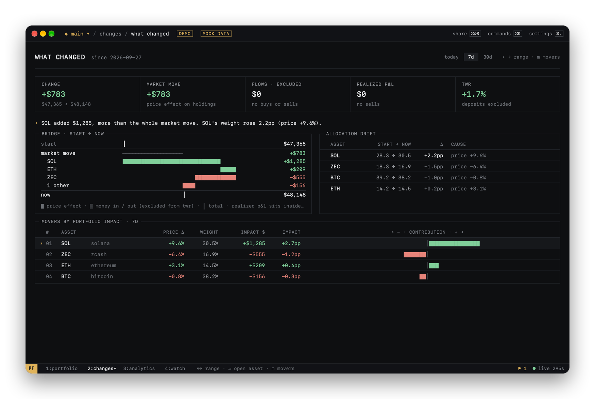
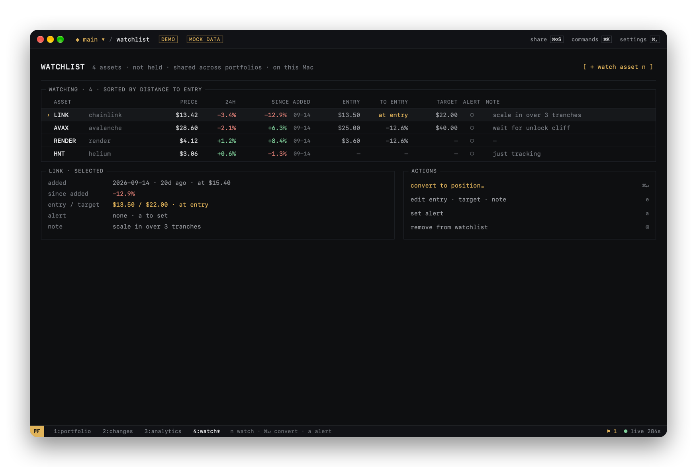
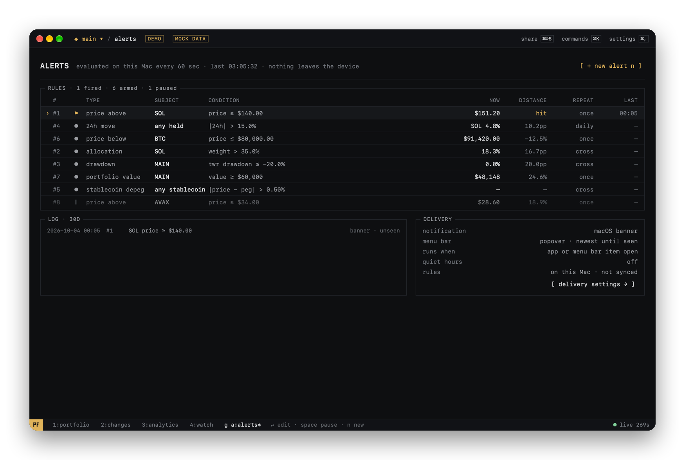
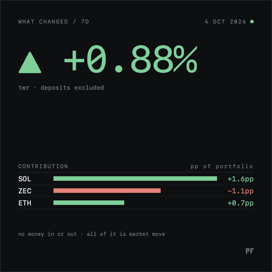
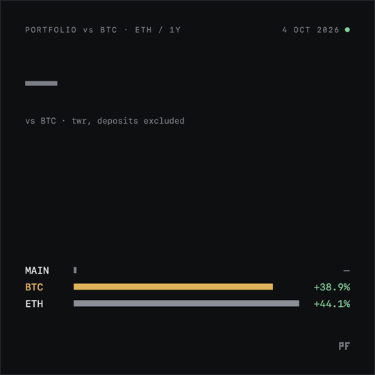
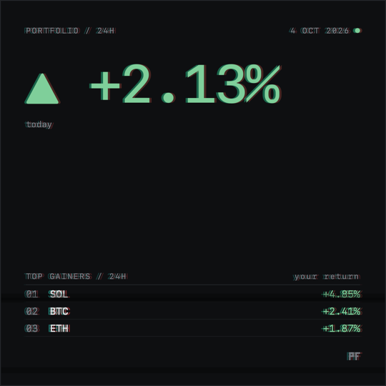

# PF Terminal · User guide

How PF Terminal works, screen by screen. Back to the [README](../README.md).

- [First run](#first-run)
- [Multiple portfolios](#multiple-portfolios)
- [Keyboard-first](#keyboard-first)
- [Portfolio intelligence](#portfolio-intelligence)
- [Analytics](#analytics)
- [Menu bar](#menu-bar)
- [Desktop widgets](#desktop-widgets)
- [Share cards](#share-cards)
- [Optional: AI agents (MCP)](#optional-ai-agents-mcp)

## First run

1. Create an empty portfolio, load the demo portfolio (clearly marked DEMO and removable), or import a backup.
2. Add a transaction with `⌘N`, or type `buy eth 0.5 @ 3500` in the palette (`⌘K`).
3. PF Terminal fetches market prices and calculates the portfolio from your transactions.

## Multiple portfolios

<p align="center">
  
</p>

Keep separate books, for example `MAIN`, `LONG TERM`, `TRADING` and `DEGEN`. Each one has its own transactions, positions, P&L, history, movers and analytics.

- **Switching.** `⌘P` opens the switcher. `[` and `]` step through the portfolios without opening it. Switching recomputes from cached prices, so it is instant.
- **ALL PORTFOLIOS** is computed, never stored. The app calculates each portfolio with its own average cost, then adds the results. The same coin held in two portfolios is not double-counted, and sells are not re-averaged across portfolios.
- **Management.** Rename, archive/restore and delete (with confirmation) on the `/ portfolios` screen. Archived portfolios keep their data but disappear from the switcher, ALL, the menu bar and the widgets.

<p align="center">
  
</p>

## Keyboard-first

<p align="center">
  
</p>

The palette understands commands as well as fuzzy search. Commands that change data always open a preview first. Nothing is written until you confirm.

```text
buy eth 0.5 @ 3500               sell btc 0.1 at 90000         in eth 2   ·   out btc 0.05
buy eth 0.5 @ 3500 in trading    (choose the destination portfolio)
target eth 10k                   target btc 150k               target eth 25x
portfolio long term              pf all                        new portfolio swing
share 24h public                 share value portrait phosphor
movers   pnl   allocation   settings   refresh   export   import
```

| Action | Keys | | Action | Keys |
|---|---|---|---|---|
| Command palette | `⌘K` | | Switch portfolio | `⌘P` |
| New transaction | `⌘N` | | Previous / next portfolio | `[` `]` |
| Refresh prices | `⌘R` | | Quick share | `⌘⇧S` |
| Portfolio · Changes · Analytics · Watch | `⌘1`–`⌘4` | | Copy / save card | `⌘C` / `⌘S` |
| Select · open · back | `↑↓` `↵` `esc` | | Chart range | `←` `→` |
| Search assets | `/` | | Target (asset) · edit · delete tx | `t` · `e` · `⌫` |
| Export backup | `⌘⇧E` | | Remove position | right-click a position |
| Go to any screen | `g` then a key | | Keys of this view · Settings | `?` · `⌘,` |

Shortcuts are bound to physical key positions, so they also work with non-Latin keyboard layouts. Keys without modifiers are ignored while a text field has focus.

## Portfolio intelligence

<p align="center">
  
</p>

- **What Changed** (`2`, or `d` from the portfolio). Today, 7d or 30d, split into the market move and money in / out (excluded from performance), with a one-line summary, a start → now bridge, allocation drift and each asset's impact on the portfolio. A missing start price is named, never estimated.
- **Watchlist** (`4`). Assets you follow without holding them: price since added, distance to your entry, target, alert and note. `⌘↵` turns a watch into a position through the add-transaction sheet.
- **Alerts** (`g a`). Price above / below, position P&L, portfolio value, weight, 24h move, stablecoin depeg, scenario target and drawdown. Each rule fires once, on every cross or daily, never on stale prices. The setup shows a 30-day backtest before you arm it. Rules run on your Mac, also from the menu bar while the window is closed.
- **Scenarios** (`g s`). Conservative · base · bull sets of target prices projected onto your holdings, compared side by side. Your targets, not forecasts.
- **Benchmark** (Analytics, `b`). TWR vs BTC and ETH buy-and-hold over 1M to ALL, in percentage points.

<p align="center">
  
</p>

<p align="center">
  
</p>

Watchlist, alert rules and scenarios stay on this Mac (`intel.json`, `alerts.json`); they are not synced.

## Analytics

<p align="center">
  
</p>

- **Performance charts** switch between **value** and **P&L** (value minus net money invested). P&L shows the drawdown periods that deposits would otherwise hide.
- **Performance headers** show the P&L change and a money-weighted return.
- **Return figures**. **Total P&L** is realized + unrealized. **Total return** is total P&L over everything ever invested, so taking profit doesn't change it. **TWR** (time-weighted return) shows market performance with deposits and withdrawals removed. **Unrealized %** is labelled as such: it only covers what is still held.
- **Drawdown** uses a time-weighted index.
- **Portfolio history** is rebuilt from what you held at each point in time. It never multiplies today's holdings by past prices.
- **The target simulator** turns a price target into position value, profit, multiple and implied market cap. It is a calculator, not a prediction.

<p align="center">
  
</p>

## Menu bar

<p align="center">
  
</p>

PF Terminal stays in the menu bar when the main window is closed, and leaves the Dock until you open the window again. To keep the Dock icon, turn on Settings → GENERAL → keep in Dock when closed.

- **Menu bar item.** Four display formats. It follows the active portfolio or is pinned to ALL.
- **Popover.** 24h change, total P&L, the top positions with value, 24h, $ impact and sparklines, what moved today, money in / out, the newest unseen alert, and buttons to open the app or the details of the day.
- **While the app is locked**, the menu bar item shows `PF 🔒` and the popover shows no portfolio data.

## Desktop widgets

<p align="center">
  
  &nbsp;
  
  &nbsp;
  
</p>

Widgets come in small, medium and large sizes. You configure each widget separately:

- **Portfolio.** Any portfolio, ALL, or follow the app.
- **Display.** Value + 24h, 24h only, or value only.
- **Privacy.** Value shown or hidden.
- **Movers.** Top gainers or biggest portfolio impact.

Widgets render a snapshot that the app has already prepared. They are not realtime terminals. The age of the data is always shown: `● now`, `upd 7m` or `STALE · 3h`. With **Settings → Widget privacy** off, the app removes dollar amounts from the widget data before writing it. Clicking a widget opens PF Terminal. In the medium and large widgets, clicking a row opens that asset.

## Share cards

<p align="center">
  
</p>

PF Terminal draws dedicated share images; it does not screenshot the window. There are three cards: **performance**, **what changed** and **vs benchmark**. The formats are square 1080×1080, landscape 1200×675 and portrait 1080×1350, in three themes, with optional effects (scanlines, glow, dither, glitch, CRT). You can copy the image, save it as PNG, or use the macOS share sheet. Animated cards (3 s: count up, typewriter or scan) export as MP4 or GIF, rendered on your Mac.

<p align="center">
  
  
  
</p>

<p align="center">
  
  
  
</p>

- **Who sees what.** The panel lists every field as visible or hidden and checks the card before you share it.
- **Privacy.** **PUBLIC** is the default. It shows percentage performance, the chart and the movers, but no value, holdings or amounts. **VALUE VISIBLE** adds the total value. In **CUSTOM**, sensitive fields (P&L, position values, average entries, portfolio name) must be switched on explicitly.
- **What the card contains.** Hidden fields never enter the card's data model, so they cannot appear in the image. Tests check this.

## Optional: AI agents (MCP)

PF works fully without any AI. If you want, you can connect an AI agent you choose (Claude Desktop, Claude Code, Cursor or another MCP client) to your local portfolio: it can answer questions about it and, if you allow it, record transactions and manage your watchlist, alerts and scenarios. Every change to the ledger waits for your confirmation in PF. It is off by default. See [AGENTS.md](AGENTS.md).
